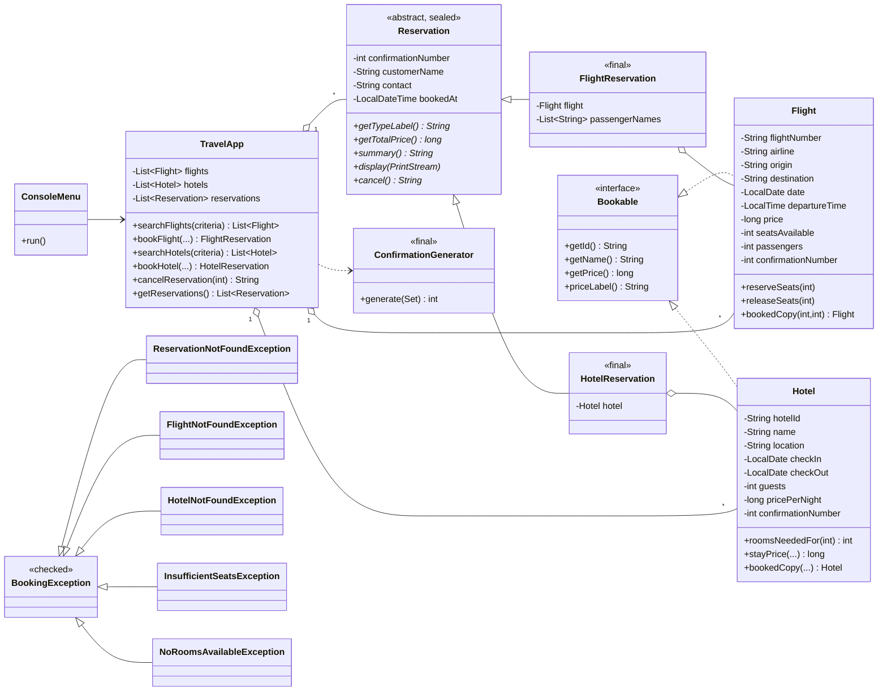

# Gaskeun - Gas ke mana aja! (Sistem Pemesanan Perjalanan, Aplikasi Konsol Java)

Aplikasi konsol terinspirasi Traveloka / Tiket.com untuk **mencari, memesan, dan membatalkan**
penerbangan dan hotel. Ditulis dengan Java 17 murni (tanpa library eksternal).

## Cara menjalankan

Prasyarat: **JDK 17 atau lebih baru** (`java -version`).

```bat
run.bat      :: compile + jalankan aplikasi
test.bat     :: compile + jalankan 29 test otomatis
```

Tanpa file `.bat` (Windows / Linux / macOS):

```bash
mkdir -p out/classes
javac --release 17 -encoding UTF-8 -d out/classes $(find src -name '*.java')
java -cp out/classes travel.Main
```

Data demo dibangkitkan **relatif terhadap hari ini** (jadwal 30 hari ke depan), jadi pencarian selalu punya hasil.
Kota yang didukung: Jakarta, Surabaya, Denpasar (alias `bali`), Yogyakarta (alias `jogja`), Bandung, Medan, Makassar.
Kota boleh ditulis dengan nama, kode bandara (`CGK`), atau alias, huruf besar/kecil bebas.

## Fitur

| Menu | Fungsi |
|---|---|
| 1. Cari Penerbangan | Input asal, tujuan, tanggal, jumlah penumpang. Tampil tabel (no. penerbangan, berangkat/tiba, durasi, harga, kursi). Tidak ada hasil: pesan "tidak ada penerbangan tersedia" + saran tanggal lain. |
| 2. Cari Hotel | Input kota, check-in, check-out, jumlah tamu. Tampil ID, nama, bintang, harga/malam, total, sisa kamar. |
| 3. Pesan Penerbangan | Pilih nomor penerbangan, isi nama tiap penumpang + kontak, ringkasan, konfirmasi, lalu e-tiket dengan nomor konfirmasi 6 digit acak. |
| 4. Pesan Hotel | Pilih ID hotel, isi data tamu, ringkasan, konfirmasi, lalu voucher. |
| 5. Batalkan Reservasi | Input nomor konfirmasi, tampil detail, konfirmasi, reservasi dihapus dan kursi/kamar dikembalikan. |
| 6. Lihat Semua Pemesanan | Tabel semua reservasi + jumlah per jenis + total pengeluaran + lihat detail. |

Validasi input: angka salah, tanggal salah format / di masa lalu, kota tak dikenal, nama dan kontak tidak valid,
nomor penerbangan / ID hotel / nomor konfirmasi yang tidak ada, kursi/kamar habis, dan EOF (Ctrl+Z / Ctrl+D)
semuanya ditangani tanpa crash.

## Desain

### Struktur paket

```
src/travel
 |- Main                      titik masuk, merangkai TravelApp + ConsoleMenu
 |- model/                    entitas & hierarki reservasi (tanpa I/O)
 |   Bookable, Flight, Hotel, Reservation (sealed), FlightReservation, HotelReservation,
 |   FlightSearchCriteria (record), HotelSearchCriteria (record)
 |- service/                  logika bisnis (tanpa I/O)
 |   TravelApp, ConfirmationGenerator (final)
 |- exception/                BookingException + 5 turunan (checked)
 |- data/SampleData           data demo
 |- ui/                       ConsoleMenu (alur dialog), ConsoleInput (Scanner aman), InputClosedException
 \- util/                     CityDirectory, ConsoleStyle, CurrencyFormat, DateFormats
test/travel/TravelAppTests    29 test otomatis
```

Prinsip utamanya adalah **memisahkan logika dari tampilan**. `TravelApp` tidak tahu soal Scanner/`System.out`,
jadi bisa diuji langsung dan bisa dipakai antarmuka lain (web/GUI) tanpa diubah.

### Diagram UML



(Diagram dirender otomatis di GitHub / VS Code. Untuk gambar, tempel blok di atas ke <https://mermaid.live>.)

### Keputusan desain yang perlu dijelaskan

- **Flight/Hotel punya dua peran** (inventori dan snapshot pesanan). Spesifikasi meminta field
  `passengers` / `confirmationNumber` ada di `Flight` dan `Hotel`. Agar banyak pesanan pada penerbangan yang sama tidak saling menimpa,
  `bookedCopy(...)` membuat salinan yang menyimpan data pesanan, sedangkan objek katalog tetap bersih.
- **Ketersediaan kamar dihitung dari reservasi aktif**, bukan counter yang diubah-ubah. Pesanan yang rentang
  tanggalnya tumpang tindih mengurangi sisa kamar, tamu yang check-in di hari check-out tamu lain tidak bentrok,
  dan pembatalan otomatis melepas kamar (tidak ada state ganda yang bisa tidak sinkron).
- **Uang memakai `long`** (Rupiah tidak punya sen), bukan `double`, untuk menghindari galat pembulatan.
- **Waktu disuntik lewat `Clock`**, jadi logika "tanggal tidak boleh di masa lalu" dan hasil test deterministik.
- **Criteria berbentuk `record`** yang memvalidasi dirinya di compact constructor, jadi objek tidak valid tidak pernah ada.
- Target `--release 17`: `instanceof` pattern, `sealed`, `record`, switch expression, dan text API Java 17 dipakai.
  `switch` dengan pattern case baru final di Java 21, jadi pembatalan memakai rantai `instanceof` agar tetap jalan di JDK 17.
  Di JDK 21+ rantai itu bisa diganti `switch (target) { case FlightReservation fr -> ...; case HotelReservation hr -> ...; }`
  tanpa `default`, karena `Reservation` sealed.

## Pemetaan ke topik kuliah dan rubrik

| Topik / kriteria | Letak di kode |
|---|---|
| Lingkungan Java, variabel, tipe data, I/O | `ConsoleInput` (Scanner, `System.out`), tipe `int`/`long`/`String`/`LocalDate` |
| Kelas, objek, metode | `Flight`, `Hotel`, `TravelApp`, `toString()` pada entitas |
| Seleksi & perulangan | Loop `while` + `switch` di `ConsoleMenu.run()`, retry loop di `ConsoleInput`, iterasi di `TravelApp.findReservation` |
| Array & koleksi | `ArrayList<Flight>`, `ArrayList<Hotel>`, `ArrayList<Reservation>`, `Map` hasil `countByType()` |
| Pewarisan, polimorfisme | `Reservation` -> `FlightReservation`/`HotelReservation`; `display()`/`cancel()`/`summary()` dipanggil lewat referensi `Reservation` |
| Enkapsulasi | Semua field `private` + getter/setter (`setConfirmationNumber`, `setSeatsAvailable`, dst.) |
| Kelas abstrak & interface | `abstract class Reservation`, `interface Bookable` |
| Exception | 5 exception custom (checked), `try/catch/finally` di `ConsoleInput`/`ConsoleMenu`, validasi `IllegalArgumentException` di record |
| Pattern matching | `instanceof FlightReservation fr` di `TravelApp.cancelReservation` |
| Lambda & stream | `stream().filter().sorted().toList()` di `searchFlights`/`searchHotels`; `Comparator` method reference; `Collectors.groupingBy` |
| Sealed & final | `sealed abstract class Reservation permits ...`; `final` pada `FlightReservation`, `HotelReservation`, `ConfirmationGenerator`, `Main` |
| Dokumentasi & pengujian | README ini, [TESTING.md](TESTING.md), `docs/sample-session.txt`, `TravelAppTests` |

## Pengembangan lanjutan (di luar cakupan tugas)

Menyimpan reservasi ke file/database agar bertahan antar sesi, pencarian pulang-pergi, pilihan kelas kabin,
dan antarmuka web yang memanggil `TravelApp` yang sama.
