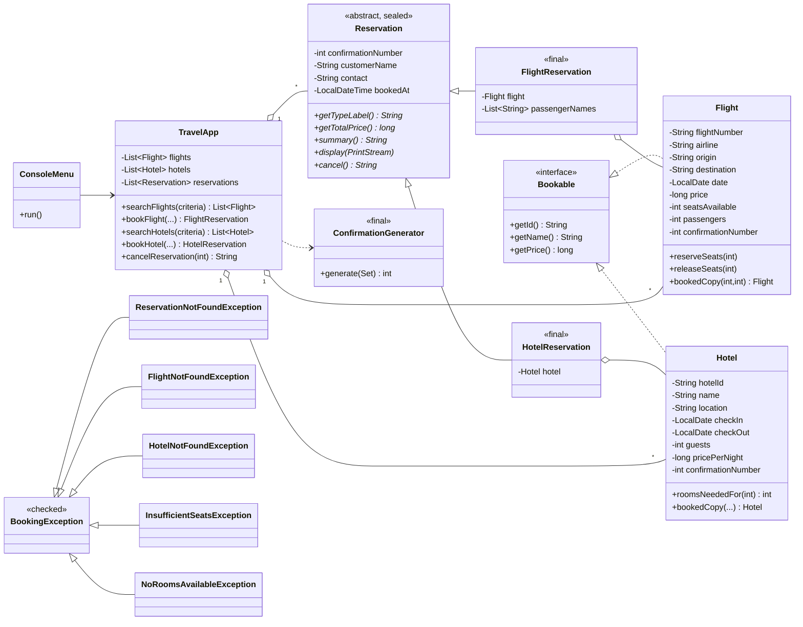

# Gaskeun - Sistem Pemesanan Perjalanan

Tugas proyek Java: aplikasi pemesanan perjalanan berbasis konsol, mirip Traveloka / Tiket.com.
Pengguna bisa mencari, memesan, dan membatalkan penerbangan dan hotel.

## Cara menjalankan

Butuh JDK 17 atau lebih baru. Cek dengan `java -version`.

Di Windows, buka terminal di folder project lalu jalankan:

```
run.bat
```

Kalau pakai PowerShell tulis `.\run.bat`. File ini akan compile lalu langsung menjalankan programnya.
Untuk menjalankan test: `test.bat`.

Cara manual:

```
mkdir out\classes
dir /s /b src\*.java > out\sources.txt
javac --release 17 -encoding UTF-8 -d out\classes @out\sources.txt
java -cp out\classes travel.Main
```

(Perintah ini untuk Command Prompt / `cmd`. Di Linux atau macOS ganti baris `dir` dengan
`find src -name '*.java' > out/sources.txt` dan pakai `/` pada path.)

## Menu

```
1. Cari Penerbangan
2. Cari Hotel
3. Pesan Penerbangan
4. Pesan Hotel
5. Batalkan Reservasi
6. Lihat Semua Pemesanan
0. Keluar
```

- **Cari penerbangan**: isi kota asal, kota tujuan, tanggal (`yyyy-MM-dd`), dan jumlah penumpang. Hasil ditampilkan
  dalam tabel, diurutkan dari harga termurah. Kalau kosong muncul pesan "tidak ada penerbangan tersedia".
- **Cari hotel**: isi kota, tanggal check-in, check-out, dan jumlah tamu.
- **Pesan**: pilih nomor penerbangan atau ID hotel dari hasil pencarian, isi data pemesan, lalu konfirmasi.
  Setelah berhasil akan keluar nomor konfirmasi 6 digit acak.
- **Batalkan**: masukkan nomor konfirmasi, kursi atau kamar dikembalikan.
- **Lihat semua pemesanan**: menampilkan semua reservasi beserta total pengeluaran.

Kota yang tersedia: Jakarta, Surabaya, Denpasar (bisa ditulis `bali`), Yogyakarta (bisa ditulis `jogja`), Bandung, Medan, Makassar.
Data penerbangan dibuat otomatis untuk 30 hari ke depan dari hari ini, jadi tanggal di luar itu tidak ada hasilnya.
Reservasi hanya tersimpan selama program berjalan (belum disimpan ke file).

Input yang salah (huruf di kolom angka, format tanggal salah, kota tidak dikenal, nomor penerbangan tidak ada, dan sebagainya)
ditangani dengan try-catch dan pengguna diminta mengisi ulang, jadi program tidak berhenti.

## Struktur project

```
src/travel
  Main.java               program utama
  model/                  Flight, Hotel, Bookable, Reservation, FlightReservation, HotelReservation,
                          FlightSearchCriteria, HotelSearchCriteria
  service/                TravelApp (logika utama), ConfirmationGenerator
  exception/              BookingException dan 5 turunannya
  data/SampleData.java    data contoh penerbangan dan hotel
  ui/                     ConsoleMenu (menu), ConsoleInput (baca input dengan Scanner)
  util/                   CityDirectory, ConsoleStyle, CurrencyFormat, DateFormats
test/travel/TravelAppTests.java
```

Logika program ada di `TravelApp`, sedangkan menu dan input/output ada di `ConsoleMenu`. Dipisah supaya
`TravelApp` bisa dites tanpa harus mengetik input manual.

## Diagram UML



Diagram ini otomatis tampil di GitHub. Kalau butuh gambar, tempel kodenya ke https://mermaid.live.

## Materi yang dipakai

| Materi | Dipakai di |
|---|---|
| Input/Output | `ConsoleInput` (Scanner) dan `System.out` di `ConsoleMenu` |
| Kelas, objek, method | `Flight`, `Hotel`, `TravelApp`, method `toString()` |
| Seleksi dan perulangan | `while` dan `switch` di `ConsoleMenu.run()`, perulangan input di `ConsoleInput` |
| Array dan koleksi | `ArrayList<Flight>`, `ArrayList<Hotel>`, `ArrayList<Reservation>` di `TravelApp` |
| Pewarisan dan polimorfisme | `Reservation` diturunkan ke `FlightReservation` dan `HotelReservation`, method `display()` dan `cancel()` di-override |
| Enkapsulasi | semua field `private` dengan getter dan setter |
| Kelas abstrak dan interface | `abstract class Reservation` dan `interface Bookable` |
| Penanganan exception | custom exception (misalnya `ReservationNotFoundException`) dan try-catch di input |
| Pattern matching | `instanceof FlightReservation fr` di `TravelApp.cancelReservation` |
| Lambda dan stream | `stream().filter(...).sorted(...)` di `searchFlights` dan `searchHotels` |
| Sealed dan final | `sealed abstract class Reservation permits ...`, kelas `final` pada `FlightReservation`, `HotelReservation`, `ConfirmationGenerator` |

## Catatan desain

- Class `Flight` dan `Hotel` dipakai dua kali: sebagai data di katalog, dan sebagai salinan saat dipesan
  (method `bookedCopy`) yang menyimpan jumlah penumpang dan nomor konfirmasi. Ini supaya beberapa pesanan di penerbangan
  yang sama tidak saling menimpa data.
- Sisa kamar hotel dihitung dari reservasi yang masih aktif di tanggal yang bertabrakan, jadi saat reservasi dibatalkan
  kamarnya otomatis tersedia lagi.
- Harga memakai `long` karena Rupiah tidak punya sen.
- Pembatalan memakai `instanceof` karena `switch` dengan pattern baru resmi di Java 21, sedangkan program ini
  dicompile untuk Java 17.

## Pengujian

Ada 29 test otomatis (`test.bat`) dan skenario uji manual lengkap di [TESTING.md](TESTING.md).
Hasil jalannya program ada di folder `docs/`.
