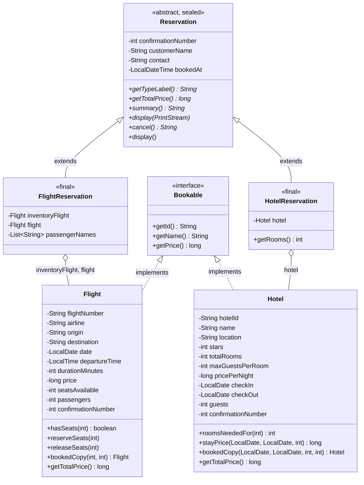
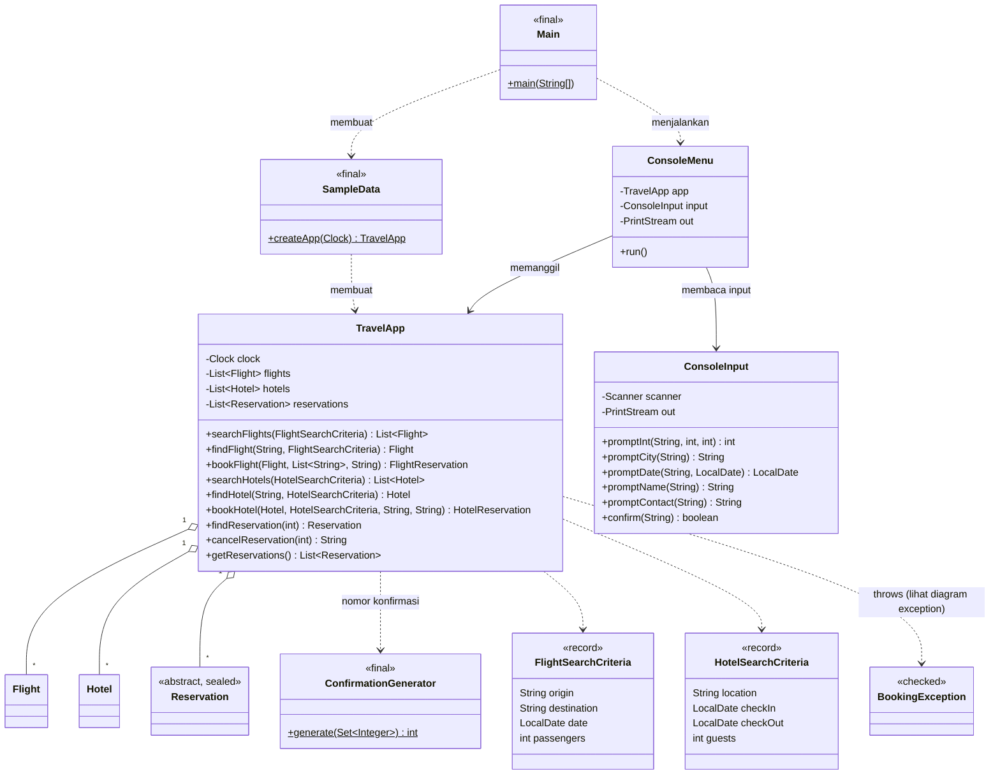
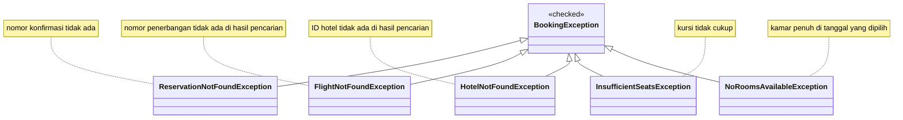

# NusaGo

> **Jelajahi Nusantara!**

Halo! Ini **NusaGo**, aplikasi pemesanan perjalanan berbasis konsol yang kami buat sebagai tugas kelompok proyek Java.
Idenya terinspirasi dari Traveloka dan Tiket.com: pengguna bisa mencari, memesan, dan membatalkan penerbangan maupun hotel,
semuanya lewat terminal.

Nama "NusaGo" kami ambil dari "Nusa" (Nusantara) dan "Go" (berangkat), kira-kira artinya "ayo jelajahi Nusantara", biar gampang diingat dan nyambung dengan tema traveling.

## Cara menjalankan

Yang dibutuhkan hanya **JDK 17 atau lebih baru**. Cek dulu dengan `java -version`.

Buka terminal di folder project, lalu jalankan:

```
run.bat
```

Kalau memakai PowerShell, tulis `.\run.bat`. File ini akan meng-compile kode sekaligus menjalankan programnya.

Kalau mau compile manual lewat Command Prompt:

```
mkdir out\classes
dir /s /b src\*.java > out\sources.txt
javac --release 17 -encoding UTF-8 -d out\classes @out\sources.txt
java -cp out\classes travel.Main
```

(Di Linux atau macOS, ganti baris `dir` dengan `find src -name '*.java' > out/sources.txt` dan pakai `/` untuk path.)

## Yang bisa dilakukan

Setelah program jalan, ada menu seperti ini:

```
1. Cari Penerbangan
2. Cari Hotel
3. Pesan Penerbangan
4. Pesan Hotel
5. Batalkan Reservasi
6. Lihat Semua Pemesanan
0. Keluar
```

- **Cari penerbangan**: masukkan kota asal, kota tujuan, tanggal (format `yyyy-MM-dd`), dan jumlah penumpang.
  Hasilnya tampil sebagai tabel, diurutkan dari harga termurah. Kalau tidak ada yang cocok, muncul pesan
  "tidak ada penerbangan tersedia" beserta saran tanggal lain.
- **Cari hotel**: masukkan kota, tanggal check-in, tanggal check-out, dan jumlah tamu.
- **Pesan**: pilih nomor penerbangan atau ID hotel dari hasil pencarian, isi data pemesan, lalu konfirmasi.
  Kalau berhasil, pengguna mendapat nomor konfirmasi 6 digit acak.
- **Batalkan**: masukkan nomor konfirmasi, lalu kursi atau kamar yang tadi dipesan dikembalikan.
- **Lihat semua pemesanan**: menampilkan seluruh reservasi beserta total pengeluarannya.

Beberapa hal yang perlu diketahui saat mencoba:

- Kota yang tersedia: Jakarta, Surabaya, Denpasar (boleh ditulis `bali`), Yogyakarta (boleh ditulis `jogja`), Bandung, Medan, dan Makassar.
- Data penerbangan dibuat otomatis untuk 30 hari ke depan dari hari ini. Tanggal di luar rentang itu tidak akan ada hasilnya.
- Reservasi hanya tersimpan selama program berjalan, belum disimpan ke file.
- Kalau input salah (huruf di kolom angka, format tanggal keliru, kota tidak dikenal, nomor penerbangan tidak ada, dan sebagainya),
  program tidak berhenti. Kesalahannya ditangkap dengan try-catch, lalu pengguna diminta mengisi ulang.

## Struktur project

```
src/travel
  Main.java               program utama
  model/                  Flight, Hotel, Bookable, Reservation, FlightReservation, HotelReservation,
                          FlightSearchCriteria, HotelSearchCriteria
  service/                TravelApp (logika utama), ConfirmationGenerator
  exception/              BookingException dan 5 turunannya
  data/SampleData.java    data contoh penerbangan dan hotel
  ui/                     ConsoleMenu (menu), ConsoleInput (baca input dengan Scanner)
  util/                   CityDirectory, ConsoleStyle, Formats
docs/                     diagram UML (.mmd dan .png) dan transkrip hasil uji
```

Logika program kami taruh di `TravelApp`, sedangkan menu dan input/output ada di `ConsoleMenu`.
Pemisahan ini bikin `TravelApp` bisa dites sendiri tanpa harus mengetik input satu per satu.

## Diagram UML

Ada tiga diagram, semuanya tampil otomatis di GitHub. Versi gambar (PNG) tersedia di folder `docs/`
untuk ditempel ke laporan: `uml-model.png`, `uml-arsitektur.png`, dan `uml-exception.png`.

### 1. Diagram kelas (model)



### 2. Diagram arsitektur



### 3. Hierarki exception



## Penerapan sesuai studi kasus

| Materi | Dipakai di |
|---|---|
| Input/Output | `ConsoleInput` (Scanner) dan `System.out` di `ConsoleMenu` |
| Kelas, objek, method | `Flight`, `Hotel`, `TravelApp`, method `toString()` |
| Seleksi dan perulangan | `while` dan `switch` di `ConsoleMenu.run()`, serta perulangan input di `ConsoleInput` |
| Array dan koleksi | `ArrayList<Flight>`, `ArrayList<Hotel>`, `ArrayList<Reservation>` di `TravelApp` |
| Pewarisan dan polimorfisme | `Reservation` diturunkan ke `FlightReservation` dan `HotelReservation`, method `display()` dan `cancel()` di-override |
| Enkapsulasi | semua field `private` dengan getter dan setter |
| Kelas abstrak dan interface | `abstract class Reservation` dan `interface Bookable` |
| Penanganan exception | custom exception (misalnya `ReservationNotFoundException`) dan try-catch pada input |
| Pattern matching | `instanceof FlightReservation fr` di `TravelApp.cancelReservation` |
| Lambda dan stream | `stream().filter(...).sorted(...)` di `searchFlights` dan `searchHotels` |
| Sealed dan final | `sealed abstract class Reservation permits ...`, serta kelas `final` pada `FlightReservation`, `HotelReservation`, dan `ConfirmationGenerator` |

## Keputusan desain kami

- **`Flight` dan `Hotel` punya dua peran.** Satu sebagai data di katalog, satu lagi sebagai salinan saat dipesan
  (method `bookedCopy`) yang menyimpan jumlah penumpang dan nomor konfirmasi. Dengan begini beberapa pesanan di penerbangan yang sama
  tidak saling menimpa data.
- **Sisa kamar hotel dihitung dari reservasi yang masih aktif** di tanggal yang bertabrakan. Jadi ketika sebuah reservasi dibatalkan,
  kamarnya otomatis tersedia lagi tanpa perlu mengatur angka secara manual.
- **Harga memakai `long`**, karena Rupiah tidak punya sen dan kami mau menghindari galat pembulatan dari `double`.
- **Pembatalan memakai `instanceof`, bukan `switch` dengan pattern.** Fitur itu baru resmi di Java 21,
  sedangkan program ini di-compile untuk Java 17 supaya bisa jalan di lebih banyak laptop.

## Pengujian

Skenario uji manual lengkap (input contoh dan hasil yang diharapkan) ada di [TESTING.md](TESTING.md).
Hasil program saat dijalankan ada di folder `docs/`.
